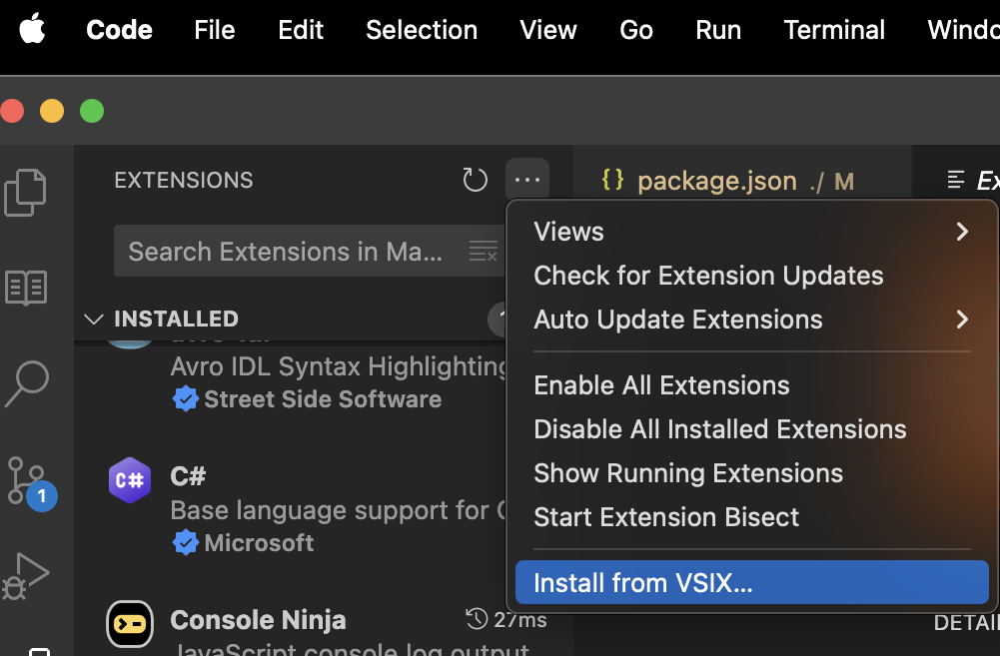

# Extension Pack

## Installing the extension pack

* To start using this extension pack first clone it from the repository (to any directory on your machine)

```shell
git clone https://github.com/coryforsythe/vscode-extensions.git
```

* Install the .VSIX file directly from the Extensions hamburger menu in Visual Studio Code

